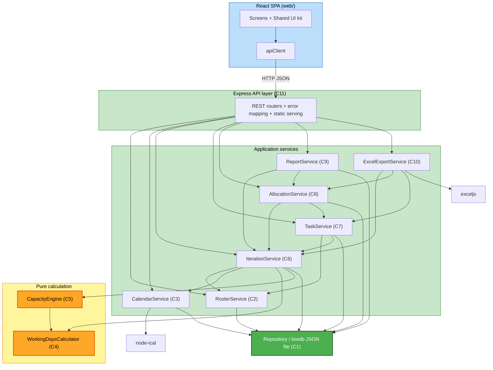

# Component Dependencies — Sprint Time Allocation / Scrum Master Software

**Stage**: INCEPTION → Application Design

---

## Dependency matrix

`✔` = row component depends on (calls / imports) column component.

| depends on →<br>▼ component | Repository | Roster | Calendar | WorkingDays | CapacityEngine | Iteration | Task | Allocation | Report | ExcelExport |
|---|:--:|:--:|:--:|:--:|:--:|:--:|:--:|:--:|:--:|:--:|
| **HTTP API (C11)** | ✔ | ✔ | ✔ | | | ✔ | ✔ | ✔ | ✔ | ✔ |
| **ReportService (C9)** | ✔ | | | | | ✔ | | ✔ | | |
| **ExcelExportService (C10)** | | | | | | ✔ | ✔ | ✔ | | |
| **AllocationService (C8)** | ✔ | | | | | ✔ | ✔ | | | |
| **TaskService (C7)** | ✔ | ✔ | | | | ✔ | | | | |
| **IterationService (C6)** | ✔ | ✔ | ✔ | ✔ | ✔ | | | | | |
| **CapacityEngine (C5)** | | | | ✔ | | | | | | |
| **WorkingDaysCalculator (C4)** | | | | | | | | | | |
| **CalendarService (C3)** | ✔ | | | | | | | | | |
| **RosterService (C2)** | ✔ | | | | | | | | | |
| **Repository (C1)** | | | | | | | | | | |

No cycles. Dependency direction flows strictly downward:
`API → Report → Allocation → {Iteration, Task} → {Roster, Calendar} → Repository`, with
`CapacityEngine → WorkingDaysCalculator` as pure leaves.

---

## Diagram



### Text alternative (dependency graph)

```
React SPA (Screens -> apiClient) --HTTP/JSON--> Express API layer (C11)

Express API layer calls: RosterService, CalendarService, IterationService,
                         TaskService, AllocationService, ReportService, ExcelExportService

ReportService        -> IterationService, AllocationService, Repository
ExcelExportService   -> IterationService, AllocationService, TaskService, exceljs
AllocationService    -> IterationService, TaskService, Repository
TaskService          -> RosterService, IterationService, Repository
IterationService     -> RosterService, CalendarService, WorkingDaysCalculator,
                        CapacityEngine, Repository
CapacityEngine       -> WorkingDaysCalculator            (pure)
WorkingDaysCalculator-> (nothing)                        (pure)
CalendarService      -> Repository, node-ical
RosterService        -> Repository
Repository           -> lowdb JSON file
```

---

## Communication patterns

| Boundary | Pattern | Notes |
|---|---|---|
| Browser ↔ API | Synchronous HTTP/JSON (REST). File upload = `multipart/form-data`. Export = binary `.xlsx` download. | No websockets; UI re-fetches after mutations (US-15). |
| API ↔ services | In-process function calls, plain objects, typed errors. | API layer catches typed errors → HTTP status codes. |
| services ↔ calculation | In-process pure function calls; inputs are plain value objects. | No side effects; fully unit-testable in isolation. |
| services ↔ Repository | In-process; read from in-memory doc, mutate, `write()` once per request. | Write mutex serialises concurrent writes. |
| Repository ↔ disk | Atomic write (temp file + rename) of the whole JSON doc. | Simple and safe at this data size. |

---

## Data flow — "view allocation review" (representative)

```
GET /api/iterations/42/allocation
  → AllocationService.allocation(42)
      → IterationService.computeCapacity(42)
          → RosterService.listMembers({activeOnly:true})        [Repository read]
          → CalendarService.holidayDatesInRange('SL', s, e)     [Repository read + parsed cache]
          → CalendarService.holidayDatesInRange('MY', s, e)
          → per member: WorkingDaysCalculator.netWorkingDays(...)
                        CapacityEngine.personBreakdown(...)
          → CapacityEngine.pools(breakdowns)
      → TaskService.listTasks(42)                                [Repository read]
      → combine: allocated / remaining / status per member
  → AllocationService.unassigned(42)
  → AllocationService.poolAllocation(42)   (subtract ReserveLines)
  → JSON response { people:[...], unassigned:{...}, pools:{...} }
```

For a **closed** iteration, `computeCapacity` / `allocation` short-circuit to the stored
`CapacitySnapshot` and no calculation or roster/calendar reads occur.
