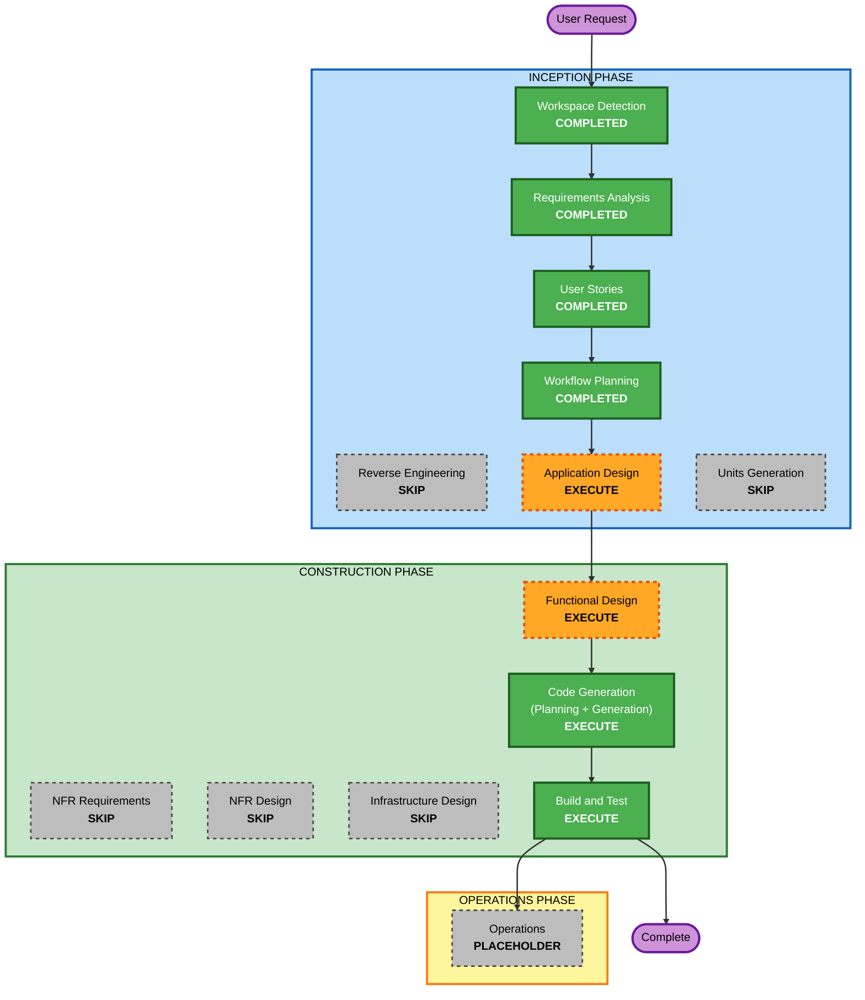

# Execution Plan — Sprint Time Allocation / Scrum Master Software

**Project type**: Greenfield
**Date**: 2026-09-01
**Inputs**: `requirements/requirements.md`, `user-stories/stories.md`, `user-stories/personas.md`

---

## Detailed Analysis Summary

### Transformation Scope
Not applicable (greenfield). A new standalone application replacing two Excel spreadsheets.

### Change Impact Assessment
| Area | Impact | Notes |
|---|---|---|
| **User-facing changes** | Yes | Entirely new UI for one persona (Scrum Master): roster, calendars, iteration setup, task assignment, allocation review, export |
| **Structural changes** | Yes (new) | New app: domain model + capacity engine + allocation + local persistence + REST API + React SPA |
| **Data model changes** | Yes (new) | TeamMember, HolidayCalendar, Iteration, IterationMember, Task, ReserveLine (see requirements §9) |
| **API changes** | Yes (new) | New internal REST API between the React SPA and the Node backend |
| **NFR impact** | Low | Local single-user app; no performance/scalability/security concerns; correctness of the capacity engine is the one NFR that matters and is handled via Functional Design + tests |

### Risk Assessment
- **Risk Level**: **Low**
  - Single small team, one deployable, no production infrastructure, no external integrations, low data sensitivity.
  - The only real risk is **calculation correctness** — mitigated by the §7 formula spec, formula-level acceptance criteria, and the US-11 validation test against a real historical iteration (204/205).
- **Rollback Complexity**: Easy — local app, single-file data store, no deployment.
- **Testing Complexity**: Moderate — the capacity engine and `.ics` parsing need thorough unit tests; the rest is straightforward CRUD + UI.

---

## Workflow Visualization



### Text alternative (workflow)

```
INCEPTION PHASE
- Workspace Detection ....... COMPLETED
- Reverse Engineering ....... SKIP  (greenfield - no existing code)
- Requirements Analysis ..... COMPLETED
- User Stories ............. COMPLETED
- Workflow Planning ........ COMPLETED (this document)
- Application Design ....... EXECUTE
- Units Generation ......... SKIP  (single small app, one deployable, no parallel teams)

CONSTRUCTION PHASE  (single unit: the whole application)
- Functional Design ....... EXECUTE  (capacity engine rules + data model)
- NFR Requirements ........ SKIP  (NFRs documented in requirements sec 8; stack chosen; extensions declined)
- NFR Design .............. SKIP  (follows NFR Requirements skip)
- Infrastructure Design ... SKIP  (local app; single-file store; one start command; no cloud)
- Code Generation ......... EXECUTE  (Planning + Generation)
- Build and Test .......... EXECUTE

OPERATIONS PHASE
- Operations .............. PLACEHOLDER
```

---

## Phases to Execute

### 🔵 INCEPTION PHASE
- [x] Workspace Detection (COMPLETED)
- [x] Reverse Engineering (SKIPPED — greenfield, no existing code)
- [x] Requirements Analysis (COMPLETED)
- [x] User Stories (COMPLETED)
- [x] Workflow Planning / Execution Plan (IN PROGRESS)
- [ ] **Application Design — EXECUTE**
  - **Rationale**: A brand-new application with several collaborating components (capacity engine, calendar/`.ics` service, allocation service, persistence, REST API, React SPA, Excel export). Component responsibilities, the service layer, and the business rules from requirements §7 need to be defined before coding. Moderate depth.
- [ ] **Units Generation — SKIP**
  - **Rationale**: One small application, one build, one deployable, built by a single team with no parallelization need and no separate services. Application Design will capture the internal module structure. Construction runs once over the whole app as a single unit. *(Can be added if you prefer a formal split, e.g. "engine core" vs "web app".)*

### 🟢 CONSTRUCTION PHASE  *(single unit — the whole application)*
- [ ] **Functional Design — EXECUTE**
  - **Rationale**: The capacity-calculation engine is rules-heavy (location-aware working days, ceremonies, buffers, capacity %, Additional Dev Buffer, SM role) and there is a new data model. These need detailed, testable design, including the US-11 validation approach against Iteration 204/205.
- [ ] **NFR Requirements — SKIP**
  - **Rationale**: Non-functional requirements are already captured in requirements §8. The tech stack is decided (Node + TypeScript backend, React frontend, local single-file store). It is a local, single-user, low-sensitivity app with no performance or scalability concerns. Security, Resiliency and Property-Based Testing extensions were all declined.
- [ ] **NFR Design — SKIP**
  - **Rationale**: No NFR Requirements stage to design against. Standard input validation and safe local writes are sufficient and will be handled in Functional Design / Code Generation.
- [ ] **Infrastructure Design — SKIP**
  - **Rationale**: No cloud resources, no deployment architecture. The app runs locally, started with one command, with a single-file data store. Nothing to map to infrastructure services.
- [ ] **Code Generation — EXECUTE (ALWAYS)**
  - **Rationale**: Implementation planning and code generation for the full application (backend engine + API, React UI, `.ics` parsing, Excel export, tests).
- [ ] **Build and Test — EXECUTE (ALWAYS)**
  - **Rationale**: Build the app; run unit tests (capacity engine + `.ics` parsing as the priority), integration tests, and the historical-iteration validation.

### 🟡 OPERATIONS PHASE
- [ ] Operations — PLACEHOLDER

---

## Estimated Timeline
- **Stages remaining to execute**: 4 (Application Design → Functional Design → Code Generation → Build and Test)
- **Estimated duration**: small project; roughly 1–2 working sessions of AI-DLC iteration per stage, dominated by Code Generation and engine testing.

## Success Criteria
- **Primary Goal**: A local web app that plans an iteration **per person**, flags over/under-allocation, and reproduces the current spreadsheet's Dev/QA pool totals within ±0.5h.
- **Key Deliverables**:
  - Node + TypeScript backend with the capacity engine, allocation logic, `.ics` ingestion, REST API, local persistence
  - React SPA covering US-1…US-19 and US-21
  - Excel export
  - Automated tests, including the Iteration 204/205 validation
- **Quality Gates**:
  - All MVP stories' acceptance criteria pass
  - Capacity engine unit tests green, including the historical-iteration check
  - App starts with a single documented command on Windows
